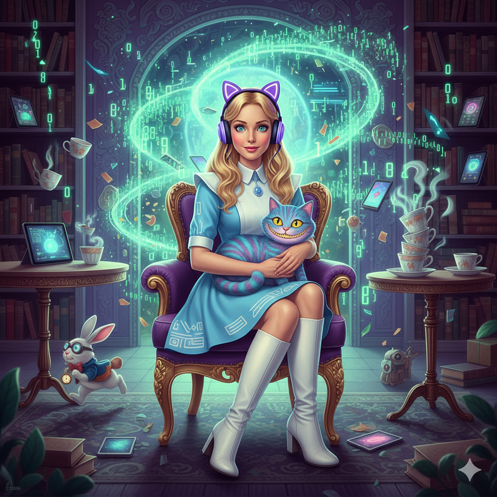

# Registro de Prompts e Resultados - Projeto Podcast IA

Este documento registra a esteira de prompts utilizados para a criação do podcast "IA-lice no País dos Algoritmos", desde a concepção do nome até a geração de artes.

---

## 1. Criação de Nomes para o Podcast

### Prompt Enviado

> Você é um roteirista de podcast, e vamos criar um podcast de tecnologia, focado em conceitos de inteligência artificial e eu gostaria de uma ajuda sua para criar 5 sugestões de nomes criativos para um podcast de conceitos de inteligência artificial, que tenha algum trocadilho sobre mundo disney no nome.
>
> O podcast vai falar sobre dicas e novidades sobre o mundo da inteligência artificial e o que está acontecendo no mercado.
>
> **{REGRAS}**
>
> * O nome deve ser enxuto, um nome e um subtítulo.
> * O nome tenha algum trocadilho disney com nomes de franquias conhecidas como princesas disney, disney classicos, turma do mickey.
> * O nome deve conter alguma palavra forte que remeta a conceitos de inteligência artificial.
>
> **{REGRAS NEGATIVAS}**
>
> * Não quero que o título contenha palavras em inglês.

### Resultado Recebido

#### Sugestão 1
**Nome:** IA-lice no País dos Algoritmos
*Desvendando as novidades do universo da inteligência artificial.*
**Conceito:** Um trocadilho direto com "Alice no País das Maravilhas". O nome já posiciona o ouvinte como um explorador em um mundo novo e fascinante (os algoritmos), com o podcast sendo o seu guia.

#### Sugestão 2
**Nome:** O Gênio do Código
*Seus três desejos de IA: dicas, notícias e tendências.*
**Conceito:** Referência clara ao Gênio de "Aladdin". A palavra "Gênio" remete à capacidade quase mágica da IA, enquanto "Código" é a base de tudo. O subtítulo reforça a promessa de entregar valor ao ouvinte.

#### Sugestão 3
**Nome:** O Ciclo da Lógica
*Entendendo o ecossistema e o futuro da inteligência artificial.*
**Conceito:** Inspirado na icônica música "O Ciclo da Vida" de "O Rei Leão". A palavra "Lógica" é fundamental para a IA, e "Ciclo" sugere a constante evolução e aprendizado das máquinas e do mercado.

#### Sugestão 4
**Nome:** Bits de Neve e os Sete Dados
*Analisando o mercado de IA, um dado de cada vez.*
**Conceito:** Um trocadilho duplo com "Branca de Neve e os Sete Anões". "Bits" é uma unidade fundamental da computação e "Dados" são a matéria-prima da IA. É um nome divertido, inteligente e que atrai quem já é da área de tecnologia.

#### Sugestão 5
**Nome:** A Bela e o Modelo
*Onde a criatividade humana encontra a inteligência artificial.*
**Conceito:** Uma releitura de "A Bela e a Fera". Aqui, "A Bela" representa as ideias e a criatividade humana, enquanto "O Modelo" se refere aos modelos de linguagem e de IA. O nome sugere uma parceria harmônica entre o homem e a máquina.

---

## 2. Roteiro do Primeiro Episódio

### Prompt Enviado

> Você é um roteirista de podcast, e vamos criar um roteiro de um podcast de tecnologia, focado em inteligência artificial o nome é "IA-lice no País dos Algoritmos" e tem foco em inteligência artificial com o público alvo de interessados em ingressar na area de machine learning e aprender a usar inteligência artificial como ferramenta no dia a dia.
>
> o formato do roteiro deve ser
> [INTRODUÇÃO]
> [CURIOSIDADE 1]
> [CURIOSIDADE 2]
> [FINALIZAÇÃO]
>
> **{REGRAS}**
>
> * no bloco [INTRODUÇÃO] substitua por uma introdução iguais as introduções dos vídeos do canal 'ei nerd', como se fossem escritos pelo Peter Jordan
> * no bloco [CURIOSIDADE 1] substitua por uma curiosidade de MACHINE LEARNING
> * no bloco [CURIOSIDADE 2] sobre O USO DE UMA FERRAMENTA DE IA
> * no bloco [FINALIZAÇÃO] substitua por uma despedida cool com o final 'Eu sou a IA-lice, me despedindo diretamente do país dos Algoritmos'
> * use termos de fácil explicação
> * O podcast vai ser apresentado somente por uma pessoa, chamada Alice, ou IA-lice, como o nome sugere
> * O podcast deve ser curto
>
> **{REGRAS NEGATIVAS}**
>
> * Não use muitos termos técnicos
> * Não ultrapasse 5 minutos de duração

### Resultado Recebido

**Roteiro do Podcast: IA-lice no País dos Algoritmos**
**Episódio 01: O Chá de Recomendações e o Gato que Pinta**

*(Trilha sonora de abertura: uma música curiosa e tecnológica, que sobe e depois diminui para fundo)*

**[INTRODUÇÃO]**

E AÍ, EXPLORADORES DE ALGORITMOS! SEJAM MUITO BEM-VINDOS! Aqui quem fala é a IA-lice, e preparem-se, porque hoje vamos mergulhar de cabeça na toca do coelho da Inteligência Artificial.
Vocês já pararam pra pensar como a Netflix ou o Spotify sabem EXATAMENTE o que você quer ver ou ouvir a seguir? Parece bruxaria, né? E se eu te disser que você pode criar uma imagem incrível, tipo um "cachorro surfista com óculos de sol", apenas descrevendo essa cena com palavras?
Pois é! Hoje, nós não vamos apenas passar pelo espelho, nós vamos quebrar ele! Então, segura na minha mão e vem comigo, que a jornada no País dos Algoritmos tá só começando!

*(Pausa dramática de 2 segundos)*

**[CURIOSIDADE 1: MACHINE LEARNING]**

Vamos começar com o nosso primeiro mistério: o chá de recomendações!
Sabe quando você termina uma série e outra parecida magicamente aparece na sua tela? O nome disso é Aprendizado de Máquina, ou Machine Learning.
Pense assim: imagine que a plataforma de streaming é um amigo seu, muito observador. Esse amigo percebe que você adora filmes de ficção científica, especialmente os que se passam no espaço. Ele também nota que você sempre pula filmes de terror.
Com o tempo, esse "amigo" aprende o seu gosto. Então, quando um novo filme de ficção científica espacial é lançado, ele pensa: "Opa, isso aqui tem a cara do meu colega!" e te recomenda.
O Aprendizado de Máquina faz exatamente isso, mas com a velocidade de um supercomputador, analisando os gostos de milhões de pessoas ao mesmo tempo para encontrar os padrões e te fazer a sugestão perfeita. Não é mágica, é só um amigo muito, muito bom em prestar atenção!

*(Pequena vinheta de transição)*

**[CURIOSIDADE 2: O USO DE UMA FERRAMENTA DE IA]**

Agora, vamos falar do nosso Gato Risonho, aquele que aparece e desaparece... só que na forma de uma ferramenta de IA que transforma texto em imagem!
Existem várias ferramentas hoje, como o Midjourney ou o DALL-E, que funcionam como um gênio da lâmpada artístico. Você é o mestre e seu desejo é um comando de texto.
Por exemplo, você pode escrever: "Crie a imagem de um gato lendo um livro de capa dura em uma biblioteca antiga, em estilo de pintura a óleo."
Em segundos, a IA processa seu pedido e... PUF! Ela cria para você uma imagem única, do zero, exatamente como você imaginou.
Isso é incrível para o dia a dia! Você pode criar uma imagem para a capa de um trabalho da faculdade, um post para suas redes sociais ou até um quadro para decorar seu quarto. Você não precisa ser um pintor, só precisa ter uma boa ideia. A IA se torna o seu pincel.

**[FINALIZAÇÃO]**

E assim, desvendamos dois dos grandes segredos deste nosso universo. Da próxima vez que um filme perfeito aparecer na sua tela, você vai sorrir e pensar "aprendizado de máquina!". E quando precisar de uma imagem que só existe na sua cabeça, lembre-se que existem gênios digitais esperando pelo seu comando.
Este País dos Algoritmos é gigante e cheio de maravilhas, e nós mal começamos a explorar.

*(Trilha sonora sobe um pouco)*

Eu sou a IA-lice, me despedindo diretamente do País dos Algoritmos.

*(Trilha sonora sobe até o final)*

---

## 3. Geração da Personagem (Arte)

### Prompt Enviado

> inspirada na personagem da alice no pais das maravilhas, faça uma versão dela adulta, com roupas modernas, com um headset de gatinho roxo e o gato de chesire no seu colo, como se fosse um gatinho na vida real, faça o cenário estiloso, inspirado totalmente no pais das maravilhas, mas com algo que remeta também a algoritmos

### Resultado Recebido

